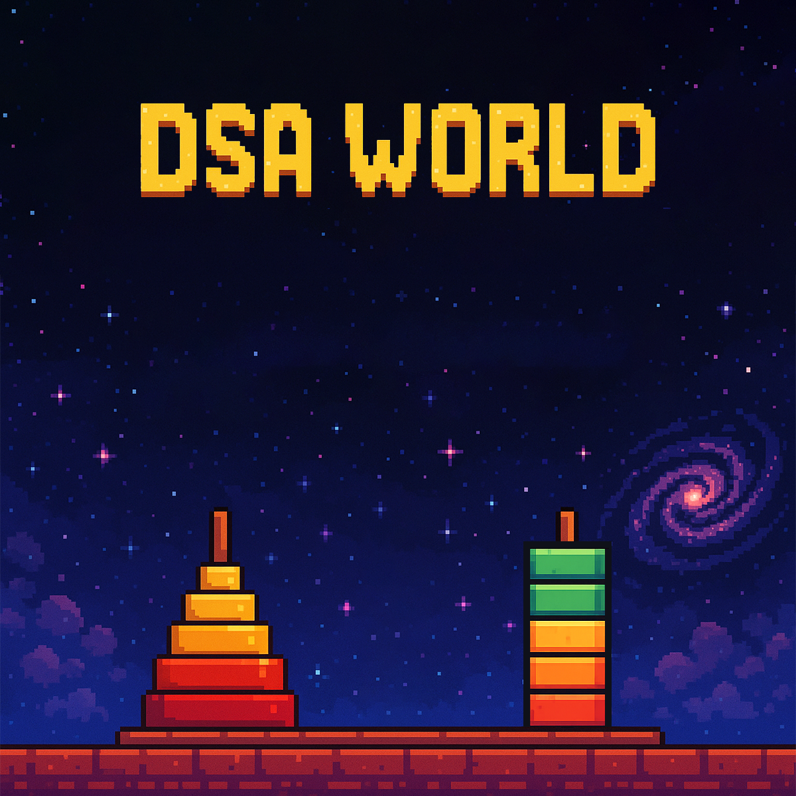

# DSA_WORLD

1. ### Welcome / Home Screen (Game-style UI)
- Title: e.g. “DSA World” with pixel-style font.

- Background: A cartoonish or pixel-art theme (can be Mario-style with pipes/boxes, etc.).

- Buttons:

  - Start (goes to visualisation menu)

  - About (shows what the app does and who made it)

  - Exit
---

2. ### Visualisation Menu (Level Selection Style)
Each data structure/algorithm is like a “level”:

- Circular Queue

- Stack

- Tower of Hanoi

- Sorting Land (Bubble, Insertion, etc.)

- Linked List Cave, etc.

Each level/icon could be clickable and take the user to that simulator.

---

3. ### Circular Queue Level (Example)
- Visual boxes in a circle.

- Front and Rear pointers as arrow images.

- Buttons: Enqueue, Dequeue, Reset

- Animated transitions with messages like “Queue is Full!”

- Maybe show code on the side with a highlighted line on each action.

---

4. ### Tower of Hanoi Level
- 3 vertical rods and draggable disks.

- Manual mode: User solves it.

- Auto mode: Recursive steps visualised with explanations.

---

5. ### Technologies / Assets
