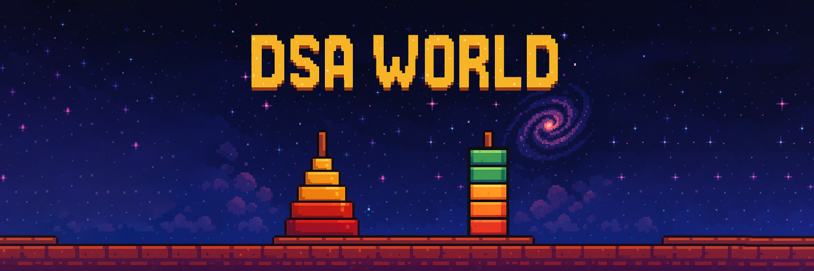

# DSA_WORLD

1. ### Welcome / Home Screen
Theme: Retro/pixel-style game UI (Mario-style, vibrant and playful)

UI Elements:
Title: "DSA World" (Use pixel font like Press Start 2P)

Background: Pixel-art world with data structure elements (stack, hanoi toweer)

Buttons (with click sounds):

Start → Goes to Visualisation Menu

About → Modal with app description and credits

Exit → Closes the app or returns to launcher
---
2. ### Visualisation Menu (Level Selection)
Each Data Structure / Algorithm is a clickable level.

Style:
Horizontal or grid-style level map

Levels styled as floating blocks or platforms

Levels:
Stack

Queue

Circular Queue

Linked List

Hanoi Tower

Each level icon includes:

Click sound

---

3. ### Circular Queue Level (Example)
Visual:

Circle of boxes (slots)

Front and Rear pointers as colorful arrows or images

Controls:

Enqueue: Adds an item with animation

Dequeue: Removes item and updates pointers

Reset: Clears all and resets pointers

Random Fill: Add random front and rear in empty items

Features:

Animated transitions and alerts (e.g., "Queue is Full!")

Show pseudocode or code with line-by-line highlight

Sound feedback on each button click

---

4. ### Tower of Hanoi Level
Visual:

3 vertical rods

Colorful, draggable disks

Modes:

Manual: User solves puzzle using drag and drop

Auto: Visualizes recursive solution step-by-step

Extras:

Error sound message for wrong move

Win sound message if you completed

Descriptive text for each move

Optional speed control

---

5. ### Technologies and Assets

Assets:
Pixel fonts, sprite backgrounds, retro UI elements

Sound effects:

Clicks

Success or error tones

Data Structures Included:
Stack

Queue

Circular Queue

Linked List
